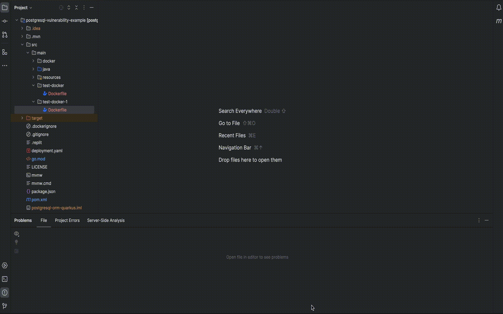

# Red Hat Dependency Analytics

[plugin-repo]: https://plugins.jetbrains.com/plugin/12541-dependency-analytics

[plugin-version-svg]: https://img.shields.io/jetbrains/plugin/v/12541-dependency-analytics.svg

[plugin-downloads-svg]: https://img.shields.io/jetbrains/plugin/d/12541-dependency-analytics.svg


[![JetBrains plugins][plugin-version-svg]][plugin-repo]
[![JetBrains plugins][plugin-downloads-svg]][plugin-repo]

Red Hat Dependency Analytics (RHDA) plugin gives you awareness to security concerns within your software supply chain
while you build your application.

**NOTE:**
<br >The Red Hat Dependency Analytics plugin is an online service hosted and maintained by Red Hat.
Dependency Analytics only accesses your manifest files to analyze your application dependencies before displaying the
vulnerability report.

**IMPORTANT:**
<br >Currently, Dependency Analytics only supports projects that use Maven (`mvn`), Node (`npm`), Golang (`go mod`),
Python (`pip`) and Gradle (`gradle`) ecosystems, and base images in `Dockerfile`.
In future releases, Red Hat plans to support other programming languages.

##### Table of Contents

- [Red Hat Dependency Analytics](#red-hat-dependency-analytics)
        - [Table of Contents](#table-of-contents)
  - [Quick start](#quick-start)
  - [Configuration](#configuration)
  - [Features](#features)
  - [Know more about the Red Hat Dependency Analytics platform](#know-more-about-the-red-hat-dependency-analytics-platform)
  - [Data and telemetry](#data-and-telemetry)
  - [Support, feedback \& questions](#support-feedback--questions)
  - [License](#license)

## Quick start

**Prerequisites**

- For Maven projects, analyzing a `pom.xml` file, you must have the `mvn` binary in your IDE's `PATH` environment.
- For Node projects, analyzing a `package.json` file, you must have the `npm` and `node` binaries in your IDE's `PATH`
  environment.
- For Golang projects, analyzing a `go.mod` file, you must have the `go` binary in your IDE's `PATH` environment.
- For Python projects, analyzing a `requirements.txt` file, you must have the `python3` and `pip3` binaries in your
  IDE's `PATH` environment.
- For base images, analyzing a `Dockerfile`, you must have
  the [`syft`](https://github.com/anchore/syft?tab=readme-ov-file#installation)
  and [`skopeo`](https://github.com/containers/skopeo/blob/main/install.md) binaries in your IDE's `PATH`
  environment.

**Procedure**

1. Install [IntelliJ IDEA](https://www.jetbrains.com/idea/download/) on your workstation.
2. After the installation finishes, open the IntelliJ IDEA application.
3. From the menu, click **Settings** , and click **Plugins**.
4. Search the **Marketplace** for _Red Hat Dependency Analytics_.
5. Click the **INSTALL** button to install the plugin.
6. To start scanning your application for security vulnerabilities, and view the vulnerability report, you can do one of
   the following:
    - Open a manifest file, hover over a dependency marked by the inline Component Analysis, indicated by the wavy-red
      line under a dependency, and click **Detailed Vulnerability Report**.
    - Right click on a manifest file in the **Project** window, and click **Dependency Analytics Report**.

## Configuration

The Red Hat Dependency Analytics plugin has some configurable parameters that allows you to customize its behavior
according to your preferences.

**Procedure**

1. Open the IntelliJ IDEA application.
2. From the menu, click **Settings** , and click **Tools**.
3. Click **Red Hat Dependency Analytics**.

   

**Configurable parameters**

- **Maven** :
  <br >Set the full path of the Maven executable, which allows Exhort to locate and execute the `mvn` command to resolve
  dependencies for Maven projects.
  <br >Path of the `JAVA_HOME` directory is required by the `mvn` executable.
  <br >If the paths are not provided, your IDE's `PATH` and `JAVA_HONE` environments will be used to locate the
  executables.

- **Node** :
  <br >Set the full path of the Node executable, which allows Exhort to locate and execute the `npm` command to resolve
  dependencies for Node projects.
  <br >Path of the directory containing the `node` executable is required by the `npm` executable.
  <br >If the paths are not provided, your IDE's `PATH` environment will be used to locate the executables.

- **Golang** :
  <br >Set the full path of the Go executable, which allows Exhort to locate and execute the `go` command to resolve
  dependencies for Go projects.
  <br >If the path is not provided, your IDE's `PATH` environment will be used to locate the executable.
  <br >When option `Strictly match package version` is selected, the resolved dependency versions will be compared to
  the versions specified in the manifest file, and users will be alerted if any mismatch is detected.

- **Python** :
  <br >Set the full paths of the Python and the package installer for Python executables, which allows Exhort to locate
  and execute the `pip3` commands to resolve dependencies for Python projects.
  <br >Python 2 executables `python` and `pip` can be used instead, if the `Use python 2.x` option is selected.
  <br >If the paths are not provided, your IDE's `PATH` environment will be used to locate the executables.
  <br >When option `Strictly match package version` is selected, the resolved dependency versions will be compared to
  the versions specified in the manifest file, and users will be alerted if any mismatch is detected.
  <br >Python virtual environment can be applied, when selecting the `Use python virtual environment` option.
  <br >If selecting option `Allow alternate package version` while using virtual environment, the dependency versions
  specified in the manifest file will be ignored, and dependency versions will be resolved dynamically instead (this
  feature cannot be enabled when `Strictly match package version` is selected).

- **Gradle** :
  <br >Set the full path of the Gradle executable, which allows Exhort to locate and execute the `gradle` command to resolve
  dependencies for Gradle projects.
  <br >By not setting a path to the gradle binary, IntelliJ IDEA uses its default path environment to locate the file.


- **Image** :
  <br >Set the full path of the Syft executable, which allows Exhort to locate and execute the `syft` command to
  generate Software Bill of Materials for the base images.
  <br >Optionally, set the full path of the Docker or Podman executable. Syft will attempt to find the images in the
  Docker or Podman daemon with the executable. Otherwise, Syft will try direct remote registry access.
  <br >Set the full path of the Skopeo executable, which allows Exhort to locate and execute the `skopeo` command to
  determine the image digests.
  <br >If the paths are not provided, your IDE's `PATH` environment will be used to locate the executables.
  <br >If a Syft configuration file is used and not at the
  default [paths](https://github.com/anchore/syft/blob/469b4c13bbc52c43bc5216924b6ffd9d6d47bbd6/README.md#configuration),
  set the full path to the configuration file in configuration.
  <br >If
  an [authentication file](https://github.com/containers/skopeo/blob/3eacbe5ae2fe859f872a02bf28c16371fb1de7b8/docs/skopeo-inspect.1.md#options)
  is applied for `skopeo inspect`, set the full path to the file in configuration.
  <br >If platform is not specified in the `Dockerfile` for multi-platform images and a default platform should be
  applied, set the default platform in the configuration. Otherwise, set the full path of the Docker or Podman
  executable, then Exhort will use the executable to determine the image platform based on the OS and architecture of
  the container runtime.

- **Inline Vulnerability Severity Alerts** :
  <br >You can set the vulnerability severity alert level to `Error` or `Warning` for inline notifications of detected
  vulnerabilities.

## Features

- **Component analysis**
  <br >Upon opening a manifest file, such as a `pom.xml`, `package.json`, `go.mod` or `requirements.txt` file, a scan
  starts the analysis process.
  The scan provides immediate inline feedback on detected security vulnerabilities for your application's dependencies.
  Such dependencies are appropriately underlined in red, and hovering over it gives you a short summary of the security
  concern.
  The summary has the full package name, version number, the amount of known security vulnerabilities, and the highest
  severity status of said vulnerabilities.

  

- **Dockerfile scanning**
  <br >Upon opening a Dockerfile, a vulnerability scan starts analyzing the images within the Dockerfile.
  After the analysis finishes, you can view any recommendations and remediation by clicking the _More actions..._ menu
  from the highlighted image name.
  Any recommendations for an alternative image does not replace the current image.
  By clicking _Switch to..._, you go to Red Hat's Ecosystem Catalog for the recommended image.

  <br >You must have the [`syft`](https://github.com/anchore/syft#installation)
  and [`skopeo`](https://www.redhat.com/en/topics/containers/what-is-skopeo) binaries installed on your workstation to
  use the Dockerfile scanning feature.
  You can specify a specific path to these binaries, and others by settings the following parameters as environment
  variables or system properties:

    * `EXHORT_SYFT_PATH` : Specify the absolute path of `syft` executable.
    * `EXHORT_SYFT_CONFIG_PATH` : Specify the absolute path to the Syft configuration file.
    * `EXHORT_SKOPEO_PATH` : Specify the absolute path of `skopeo` executable.
    * `EXHORT_SKOPEO_CONFIG_PATH` : Specify the absolute path to the authentication file used by the `skopeo inspect`
      command.
    * `EXHORT_DOCKER_PATH` : Specify the absolute path of `docker` executable.
    * `EXHORT_PODMAN_PATH` : Specify the absolute path of `podman` executable.
    * `EXHORT_IMAGE_PLATFORM` : Specify the platform used for multi-arch images.

  

- **Excluding dependencies with `exhortignore`**
  <br >You can exclude a package from analysis by marking the package for exclusion.
  If you want to ignore vulnerabilities for a dependency in a `pom.xml` file, you must add `exhortignore` as a comment
  against the dependency, group id, artifact id, or version scopes of that particular dependency in the manifest file.
  For example:
  ```xml
  <dependency> <!--exhortignore-->
      <groupId>...</groupId>
      <artifactId>...</artifactId>
      <version>...</version>
  </dependency>
  ```

  If you want to ignore vulnerabilities for a dependency in a `package.json` file, you must add `exhortignore` as a
  attribute-value pair.
  For example:
  ```json
  {
      "name": "sample",
      "version": "1.0.0",
      "description": "",
      "main": "index.js",
      "keywords": [],
      "author": "",
      "license": "ISC",
      "dependencies": {
          "dotenv": "^8.2.0",
          "express": "^4.17.1",
          "jsonwebtoken": "^8.5.1",
          "mongoose": "^5.9.18"
      },
      "exhortignore": [
          "jsonwebtoken"
      ]
  }
  ```

  If you want to ignore vulnerabilities for a dependency in a `go.mod` file, you must add `exhortignore` as a comment
  against the dependency in the manifest file.
  For example:
  ```text
  require (
      golang.org/x/sys v1.6.7 // exhortignore
  )
  ```

  If you want to ignore vulnerabilities for a dependency in a `requirements.txt` file, you must add `exhortignore` as a
  comment against the dependency in the manifest file.
  For example:
  ```text
  requests==2.28.1 # exhortignore
  ```
  If you want to ignore vulnerabilities for a dependency in a `build.gradle` file, you must add `exhortignore` as a
  comment against the dependency in the manifest file.
  For example:
  ```text
  implementation "log4j:log4j:1.2.17" // exhortignore
  implementation group: 'log4j', name: 'log4j', version: '1.2.17' // exhortignore 
  ```

- **Excluding developmental or test dependencies**
  <br >Red Hat Dependency Analytics does not analyze dependencies marked as `dev` or `test`, these dependencies are
  ignored.
  For example, setting `test` in the `scope` tag within a `pom.xml` file:
  ```xml
  <dependency>
      <groupId>...</groupId>
      <artifactId>...</artifactId>
      <version>...</version>
      <scope>test</scope>
  </dependency>
  ```

  For example, setting `devDependencies` attributte in the `package.json` file:
  ```json
  {
      "name": "sample",
      "version": "1.0.0",
      "description": "",
      "main": "index.js",
      "keywords": [],
      "author": "",
      "license": "ISC",
      "dependencies": {
          "dotenv": "^8.2.0",
          "express": "^4.17.1",
          "jsonwebtoken": "^8.5.1",
          "mongoose": "^5.9.18"
      },
      "devDependencies": {
          "axios": "^0.19.0"
      }
  }
  ```

  For example, setting `exclude` attribute in the `go.mod` file:
  ```text
  exclude golang.org/x/sys v1.6.7

  exclude (
      golang.org/x/sys v1.6.7
  )
  ```

  You can create an alternative file to `requirements.txt`, for example, a `requirements-dev.txt` or
  a `requirements-test.txt` file where you can add the development or test dependencies there.

- **Red Hat Dependency Analytics report**
  <br >The Red Hat Dependency Analytics report is a temporary HTML file that exist if the **Red Hat Dependency Analytics
  Report** tab remains open.
  Closing the tab removes the temporary HTML file.

## Know more about the Red Hat Dependency Analytics platform

The goal of this project is to significantly enhance a developer's experience by providing helpful vulnerability
insights for their applications.

- [GitHub Organization](https://github.com/redhat-developer)

## Data and telemetry

The Red Hat Dependency Analytics plugin for IntellJ IDEA collects anonymous [usage data](USAGE_DATA.md) and sends it to
Red Hat servers to help improve our products and services.
Read our [privacy statement](https://developers.redhat.com/article/tool-data-collection) to learn more.
This plugin respects the settings of the `Telemetry by Red Hat` plugin, which you can learn more
about [here](https://plugins.jetbrains.com/plugin/16209-telemetry-by-red-hat).


## Support, feedback & questions

The Red Hat Dependency Analytics plugin for IntelliJ IDEA in current version, supports the following IntelliJ IDEA versions:
 - 2022.1
 - 2022.2
 - 2022.3
 - 2023.1
 - 2023.2
 - 2023.3

There are two ways you can contact us:

- You can reach out to us at `rhda-support@redhat.com` with any questions, feedback, and general support.
- You can also file a [GitHub Issue](https://github.com/redhat-developer/intellij-dependency-analytics/issues).

## License

EPL 2.0, See [LICENSE](LICENSE) for more information.