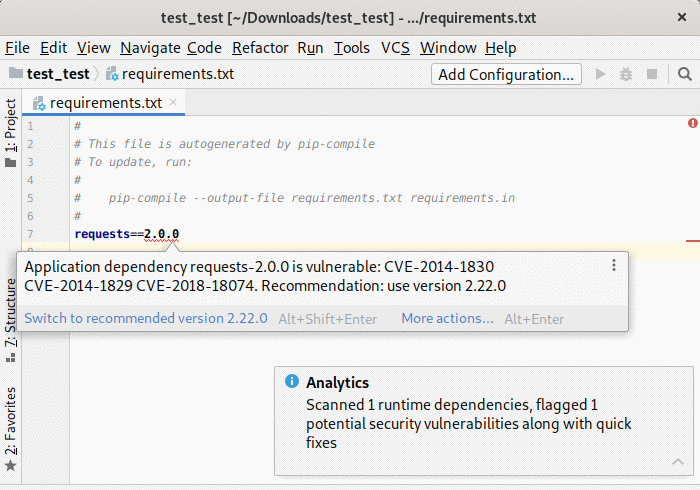
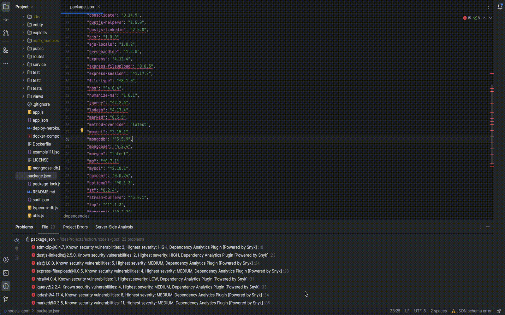

# Dependency Analytics

[plugin-repo]: https://plugins.jetbrains.com/plugin/12541-dependency-analytics
[plugin-version-svg]: https://img.shields.io/jetbrains/plugin/v/12541-dependency-analytics.svg
[plugin-downloads-svg]: https://img.shields.io/jetbrains/plugin/d/12541-dependency-analytics.svg

[![JetBrains plugins][plugin-version-svg]][plugin-repo]
[![JetBrains plugins][plugin-downloads-svg]][plugin-repo]

Dependency Analytics is powered by [Snyk Intel Vulnerability DB](https://snyk.io/product/vulnerability-database/). It is the most advanced and accurate open source vulnerability database in the industry, that adds value with the latest, fastest and most number of vulnerabilities derived from numerous sources.

'Dependency Analytics Report' with Insights about your application dependencies:

- Flags a security vulnerability(CVE) and suggests a remedial version
- Shows Github popularity metrics along with latest version
- Suggests a project level license, check for conflicts between dependency licences
- AI based guidance for additional, alternative dependencies

> **Disclaimer**: Dependency Analytics does not analyse **dev/test** dependencies.

## Supported Languages

'Dependency Analytics' plugin supports Java (Maven), Npm (Node), Python and Golang projects.
Extending support for other languages is currently under progress.

> **NOTE** Dependency Analytics is an online service hosted and maintained by Red Hat. This open source software will access only your manifests file(s) to learn about application dependencies before giving you the report.

## Prerequisites
This plug-in assumes that you have installed all packages given in target manifest file which will be used to create transitive dependency for showing Stack Analysis, you also need to have following binaries on your IDE PATH:

- mvn (for analyzing Java applications)
- npm (for analyzing Node applications)
- python (for analyzing Python applications)
- go (for analyzing Golang applications)

**Note**: In this plug-in mvn/npm/go/python commands are executed using 'ProcessBuilder', which requires that binaries for thse are found in your IDE Environment PATH.

## Quick Start

- Install the plugin.
-  Opening or editing a manifest file (pom.xml / package.json / requirements.txt / go.mod) scans your application for security vulnerabilities.
-  Click on icon from 'Navigation bar' or right click on a manifest file (pom.xml/package.json / requirements.txt / go.mod) in the 'File explorer' or 'File editor' to display 'Dependency Analytics Report' for your application.

## Features

1. Opening or editing a manifest file (`pom.xml` / `package.json` / `requirements.txt` / `go.mod`) scans your application for security vulnerabilities, flag them along with 'quick fixes'.

2. Right click on a manifest file(`pom.xml` / `package.json` / `requirements.txt` / `go.mod`) and choose 'Dependency Analytics Report ...' OR click on  icon in navigation bar to display 'Dependency Analytics' report as shown below. This report covers deeper insights into your application dependencies:

- Flags a security vulnerability(CVE) and suggests a remedial version
- Shows Github popularity metrics along with latest version
- Suggests a project level license, check for conflicts between dependency licences
- AI based guidance for additional,alternative dependencies

# Know more about Dependency Analytics Platform

The mission of this project is to significantly enhance developer experience:
providing Insights(security) for applications and helping developers, Enterprises.

- [GitHub Organization](https://github.com/redhat-developer)

# Feedback & Questions

- File a bug in [GitHub Issues](https://github.com/redhat-developer/intellij-dependency-analytics/issues)

# License

EPL 2.0, See [LICENSE](LICENSE) for more information.
