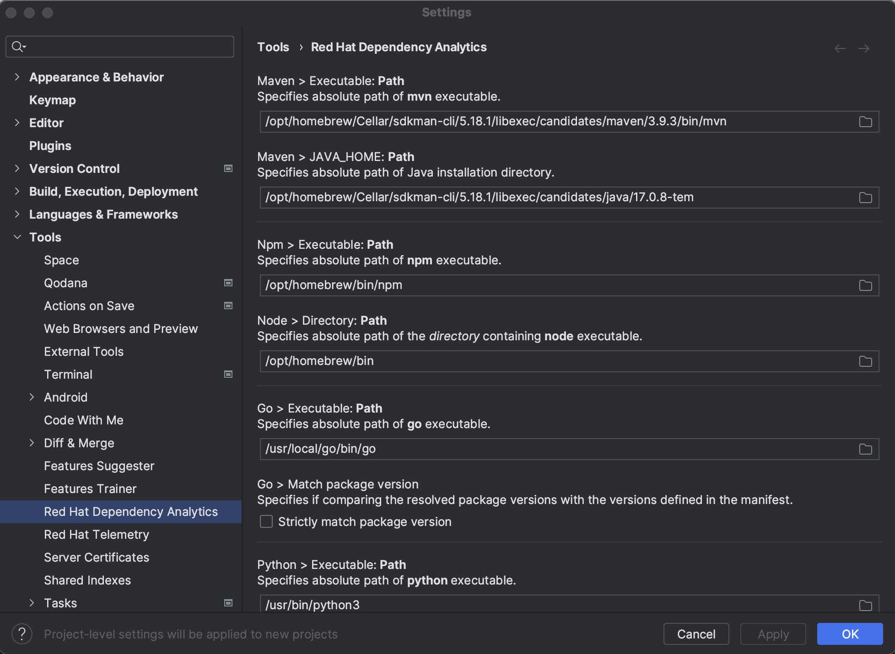
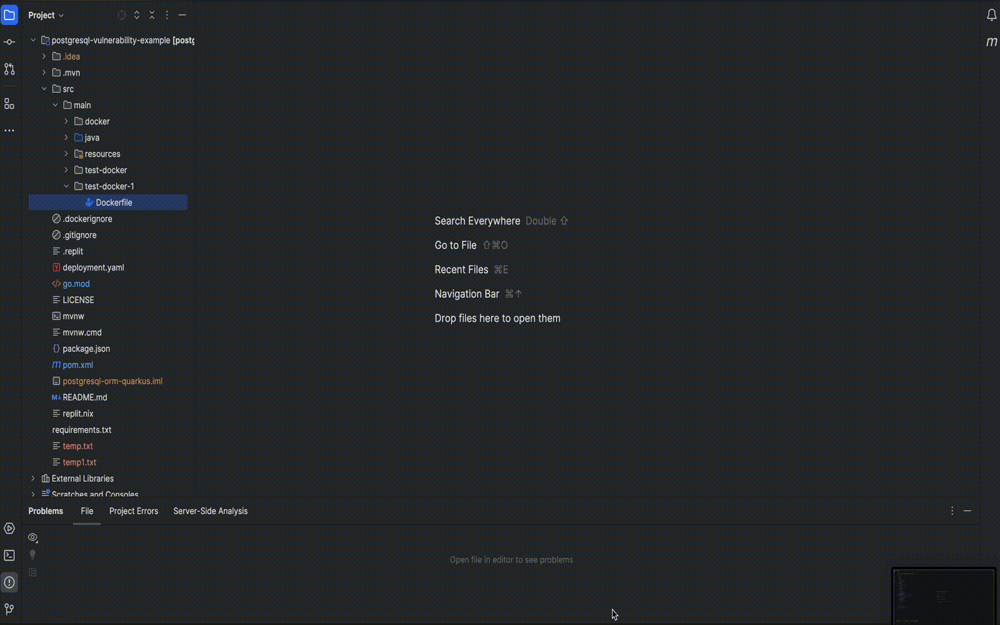

# Red Hat Dependency Analytics

[plugin-repo]: https://plugins.jetbrains.com/plugin/12541-dependency-analytics

[plugin-version-svg]: https://img.shields.io/jetbrains/plugin/v/12541-dependency-analytics.svg

[plugin-downloads-svg]: https://img.shields.io/jetbrains/plugin/d/12541-dependency-analytics.svg


[![JetBrains plugins][plugin-version-svg]][plugin-repo]
[![JetBrains plugins][plugin-downloads-svg]][plugin-repo]

Red Hat Dependency Analytics (RHDA) plugin gives you awareness to security concerns within your software supply chain
while you build your application.
The Dependency Analytics plugin uses the Snyk REST API to
query [Snyk's Vulnerability Database](https://snyk.io/product/vulnerability-database/) for the most up-to-date
vulnerability information available.
Snyk uses industry-leading security intelligence by pulling from many data sources to give you exact vulnerability
information.

**NOTE:**
<br >The Red Hat Dependency Analytics plugin is an online service hosted and maintained by Red Hat.
Dependency Analytics only accesses your manifest files to analyze your application dependencies before displaying the
vulnerability report.

**IMPORTANT:**
<br >Currently, Dependency Analytics only supports projects that use Maven (`mvn`), Node (`npm`), Golang (`go mod`) and
Python (`pip`) ecosystems.
In future releases, Red Hat plans to support other programming languages.

##### Table of Contents

- [Quick start](#quick-start)
- [Configuration](#configuration)
- [Features](#features)
- [Know more about the Red Hat Dependency Analytics platform](#know-more-about-the-red-hat-dependency-analytics-platform)
- [Data and telemetry](#data-and-telemetry)
- [Support, feedback \& questions](#support-feedback--questions)
- [License](#license)

## Quick start

**Prerequisites**

- For Maven projects, analyzing a `pom.xml` file, you must have the `mvn` binary in your IDE's `PATH` environment.
- For Node projects, analyzing a `package.json` file, you must have the `npm` and `node` binaries in your IDE's `PATH`
  environment.
- For Golang projects, analyzing a `go.mod` file, you must have the `go` binary in your IDE's `PATH` environment.
- For Python projects, analyzing a `requirements.txt` file, you must have the `python3` and `pip3` binaries in your
  IDE's `PATH` environment.

**Procedure**

1. Install [IntelliJ IDEA](https://www.jetbrains.com/idea/download/) on your workstation.
2. After the installation finishes, open the IntelliJ IDEA application.
3. From the menu, click **Settings** , and click **Plugins**.
4. Search the **Marketplace** for _Red Hat Dependency Analytics_.
5. Click the **INSTALL** button to install the plugin.
6. To start scanning your application for security vulnerabilities, and view the vulnerability report, you can do one of
   the following:
    - Open a manifest file, hover over a dependency marked by the inline Component Analysis, indicated by the wavy-red
      line under a dependency, and click **Detailed Vulnerability Report**.
    - Right click on a manifest file in the **Project** window, and click **Dependency Analytics Report**.
7. (OPTIONAL) You can link your Snyk account to Dependency Analytics by doing the following:
    1. Log into
       your [Snyk account](https://app.snyk.io/login?utm_campaign=Code-Ready-Analytics-2020&utm_source=code_ready&code_ready=FF1B53D9-57BE-4613-96D7-1D06066C38C9).
    2. On the account landing page, you can find your Snyk Token, copy the token.
    3. Set the Snyk token as the value of your IDE's `EXHORT_SNYK_TOKEN` environment.
    4. After adding your Snyk token, the vulnerability report gives you detailed information about security
       vulnerabilities unique to Snyk, and vulnerabilities that have publicly known exploits.

## Configuration

The Red Hat Dependency Analytics plugin has some configurable parameters that allows you to customize its behavior
according to your preferences.

**Procedure**

1. Open the IntelliJ IDEA application.
2. From the menu, click **Settings** , and click **Tools**.
3. Click **Red Hat Dependency Analytics**.

   

**Configurable parameters**

- **Maven** :
<br >Path of the `mvn` executable allows Exhort to locate and execute the `mvn` command to resolve dependencies for
Maven projects.
Path of the `JAVA_HOME` directory is required by the `mvn` executable.
If the paths are not provided, your IDE's `PATH` and `JAVA_HONE` environments will be used to locate the executables.

- **Npm** :
<br >Path of the `npm` executable allows Exhort to locate and execute the `npm` command to resolve dependencies for Node
projects.
Path of the directory containing the `node` executable is required by the `npm` executable.
If the paths are not provided, your IDE's `PATH` environment will be used to locate the executables.

- **Golang** :
<br >Path of the `go` executable allows Exhort to locate and execute the `go` command to resolve dependencies for Go
projects.
If the path is not provided, your IDE's `PATH` environment will be used to locate the executable.

- **Python** :
<br >Paths of the `python3` and `pip3` executables allow Exhort to locate and execute the `pip3` commands to resolve
dependencies for Python projects.
Python 2 executables `python` and `pip` can be used instead, if the `Use python 2.x` option is selected.
Python virtual environment can be applied, if the `Use python virtual environment` option is selected.
If the paths are not provided, your IDE's `PATH` environment will be used to locate the executables.

- **Exhort Snyk Token** :
<br >The Snyk token allows Exhort to authenticate with the Snyk Vulnerability Database.
If a Snyk token is not provided, Snyk vulnerability information is not displayed.

If you need a new Snyk token, you can generate a new
token [here](https://app.snyk.io/login?utm_campaign=Code-Ready-Analytics-2020&utm_source=code_ready&code_ready=FF1B53D9-57BE-4613-96D7-1D06066C38C9).

## Features

- **Component analysis**
  <br >Upon opening a manifest file, such as a `pom.xml`, `package.json`, `go.mod` or `requirements.txt` file, a scan
  starts the analysis process.
  The scan provides immediate inline feedback on detected security vulnerabilities for your application's dependencies.
  Such dependencies are appropriately underlined in red, and hovering over it gives you a short summary of the security
  concern.
  The summary has the full package name, version number, the amount of known security vulnerabilities, and the highest
  severity status of said vulnerabilities.

  

- **Excluding dependencies with `exhortignore`**
  <br >You can exclude a package from analysis by marking the package for exclusion.
  If you wish to ignore vulnerabilities for a dependency in a `pom.xml` file, you must add `exhortignore` as a comment
  against the dependency, group id, artifact id, or version scopes of that particular dependency in the manifest file.
  For example:

  ```xml
  <dependency> <!--exhortignore-->
      <groupId>...</groupId>
      <artifactId>...</artifactId>
      <version>...</version>
  </dependency>
  ```

  If you wish to ignore vulnerabilities for a dependency in a `package.json` file, you must add `exhortignore` as a
  attribute-value pair.
  If `exhortignore` is followed by a list of comma-separated Snyk vulnerability IDs, only the listed vulnerabilities
  will be ignored during analysis.
  For example:

  ```json
  {
      "name": "sample",
      "version": "1.0.0",
      "description": "",
      "main": "index.js",
      "keywords": [],
      "author": "",
      "license": "ISC",
      "dependencies": {
          "dotenv": "^8.2.0",
          "express": "^4.17.1",
          "jsonwebtoken": "^8.5.1",
          "mongoose": "^5.9.18"
      },
      "exhortignore": [
          "jsonwebtoken"
      ]
  }
  ```

  If you wish to ignore vulnerabilities for a dependency in a `go.mod` file, you must add `exhortignore` as a comment
  against the dependency in the manifest file.
  For example:
  ```
  require (
      golang.org/x/sys v1.6.7 // exhortignore
  )
  ```

  If you wish to ignore vulnerabilities for a dependency in a `requirements.txt` file, you must add `exhortignore` as a
  comment against the dependency in the manifest file.
  For example:
  ```
  requests==2.28.1 # exhortignore
  ```

- **Excluding developmental or test dependencies**
  <br >Red Hat Dependency Analytics does not analyze dependencies marked as `dev` or `test`, these dependencies are
  ignored.
  For example, setting `test` in the `scope` tag within a `pom.xml` file:
  ```xml
  <dependency>
      <groupId>...</groupId>
      <artifactId>...</artifactId>
      <version>...</version>
      <scope>test</scope>
  </dependency>
  ```

  For example, setting `devDependencies` attributte in the `package.json` file:
  ```json
  {
      "name": "sample",
      "version": "1.0.0",
      "description": "",
      "main": "index.js",
      "keywords": [],
      "author": "",
      "license": "ISC",
      "dependencies": {
          "dotenv": "^8.2.0",
          "express": "^4.17.1",
          "jsonwebtoken": "^8.5.1",
          "mongoose": "^5.9.18"
      },
      "devDependencies": {
          "axios": "^0.19.0"
      }
  }
  ```

  For example, setting `exclude` attribute in the `go.mod` file:
  ```
  exclude golang.org/x/sys v1.6.7

  exclude (
      golang.org/x/sys v1.6.7
  )
  ```

  For example, creating an alternative file to `requirements.txt`, like `requirements-dev.txt`
  or `requirements-test.txt` and adding the dev or test dependencies there instead.

- **Red Hat Dependency Analytics report**
  <br >The Red Hat Dependency Analytics report is a temporary HTML file that exist if the **Red Hat Dependency Analytics
  Report** tab remains open.
  Closing the tab removes the temporary HTML file.

## Know more about the Red Hat Dependency Analytics platform

The goal of this project is to significantly enhance a developer's experience by providing helpful vulnerability
insights for their applications.

- [GitHub Organization](https://github.com/redhat-developer)

## Data and telemetry

The Red Hat Dependency Analytics plugin for IntellJ IDEA collects anonymous [usage data](USAGE_DATA.md) and sends it to
Red Hat servers to help improve our products and services.
Read our [privacy statement](https://developers.redhat.com/article/tool-data-collection) to learn more.
This plugin respects the settings of the `Telemetry by Red Hat` plugin, which you can learn more
about [here](https://plugins.jetbrains.com/plugin/16209-telemetry-by-red-hat).

## Support, feedback & questions

There are two ways you can contact us:

- You can reach out to us at `rhda-support@redhat.com` with any questions, feedback, and general support.
- You can also file a [GitHub Issue](https://github.com/redhat-developer/intellij-dependency-analytics/issues).

## License

EPL 2.0, See [LICENSE](LICENSE) for more information.